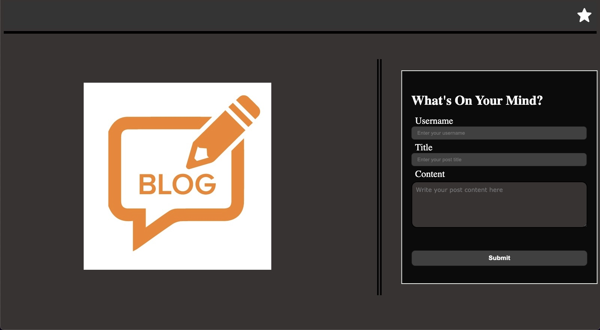

# my-blog

[Deployed Link](https://imneeeks.github.io/my-blog/)

## Description

This is a blog application that utilizes HTML/CSS/JS.

## Features

- Dark mode / Light mode (Click the star)

- Landing page with a form with inputs for a username, blog title, blog content.

- When blog is posted, data is stored in localStorage and user is redirected to BLOG post entry page.

- BLOG page contains back button to return to home poage and top right of blog entries will allow users to delete posted blogs.

- Submitting blogs with empty fields will result in warning message.

- Blog entry page contains working link to dev's portfolio.

- Viewing localSTORAGE will show JSON array of blog post objects.

